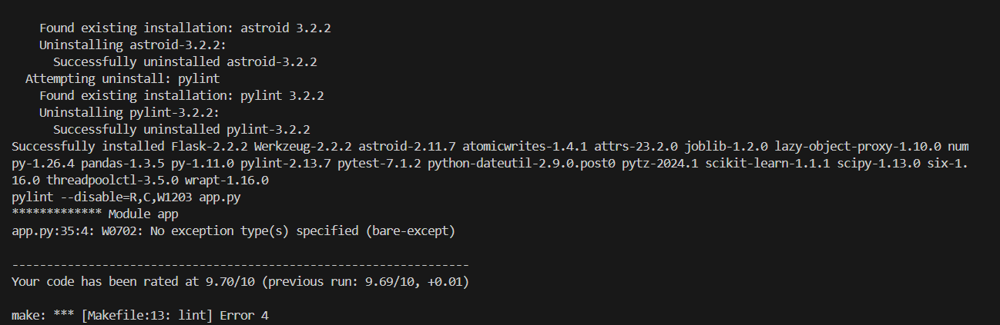
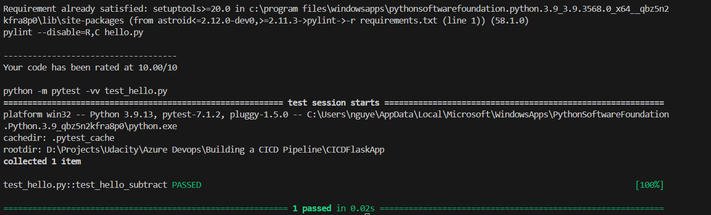
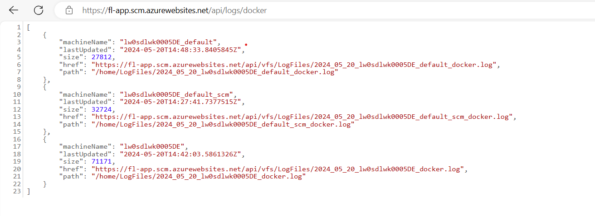

# Overview


## Project Plan

* A [link](https://trello.com/b/Wgsr5BSy/devops-cicd) to a Trello board for the project
* A link to a [spreadsheet](./Project Plan 2024.xlsx) that includes the original and final project plan 

## Instructions

# Architectural Diagram (Shows how key parts of the system work)


# Setup Azure Cloud Shell
* Login portal Azure
* Launch Cloud Shell from the top navigation of the Azure portal
* Select the Subscription used to create the storage account and file share
* Select Create storage

# Project running on Azure App Service
* Move to flask-sklearn folder by cmd `cd flask-sklearn`
* Run command line `az webapp up --name fl-app -g Azuredevops --sku B1 --logs --runtime "PYTHON:3.9"` to deploy Azure App Service


# Project cloned into Azure Cloud Shell
* Run command line `ssh-keygen` to generate ssh-key of yourself
* Go to Github Settings
* Select `SSH and GPG keys`
* Click New SSH Key button
* Give the Title and the generated public key from Step 1
* Click Add SSH Key
* Use `git clone git@github.com:nguyennhutamthien1993/IaCWebApp.git` to clone repository

# Passing tests that are displayed after running the `make all` command from the `Makefile`
* Run command line `make all` with the result below:

# Output of a test run


# Successful deploy of the project in Azure Pipelines.  [Note the official documentation should be referred to and double checked as you setup CI/CD](https://docs.microsoft.com/en-us/azure/devops/pipelines/ecosystems/python-webapp?view=azure-devops).
* Create AzureDevops Organization
* Create AzureDevops Project
* Create Azure Self-Hosted Agent Pool
* Create PAT from AzureDevops Settings
* Create VM for Agent Build
* Download AzureDevops Agent Service, configure and start service AzureDevops Agent Service
* Install required libraries, tools such as Python, Make, Azure CLI
* Logon AzureDevops Agent Service as Admin Account
* Create New Pipeline, configure Github Source
* Trigger change in Github Source or trigger Run Pipeline from AzureDevops

# Running Azure App Service from Azure Pipelines automatic deployment

# Successful prediction from deployed flask app in Azure Cloud Shell.  [Use this file as a template for the deployed prediction](https://github.com/udacity/nd082-Azure-Cloud-DevOps-Starter-Code/blob/master/C2-AgileDevelopmentwithAzure/project/starter_files/flask-sklearn/make_predict_azure_app.sh).
The output should look similar to this:

```bash
udacity@Azure:~$ ./make_predict_azure_app.sh
Port: 443
{"prediction":[20.35373177134412]}
```


* Output of streamed log files from deployed application




# Loadtest with locust
* Install locust tool by `pip install locust`
* Run command `locust -y locustfile.py` to open loadtest from UI
* Input concurrent users, ramp up time and host
* Finally start swarm
* Stop loadtest by Stop button when you are satisfied


## Enhancements

Use Github Actions to perform Continous Delivery 

## Demo 

<TODO: Add link Screencast on YouTube>


